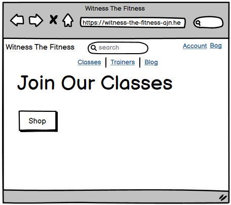
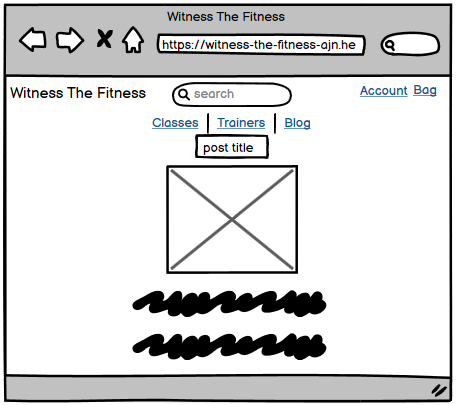
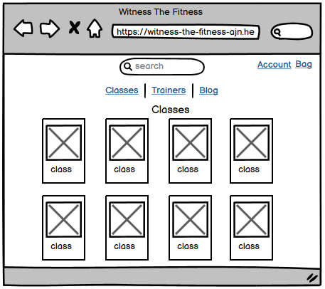
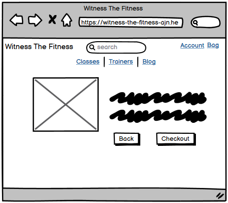
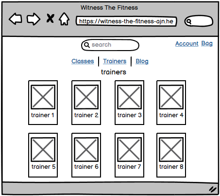
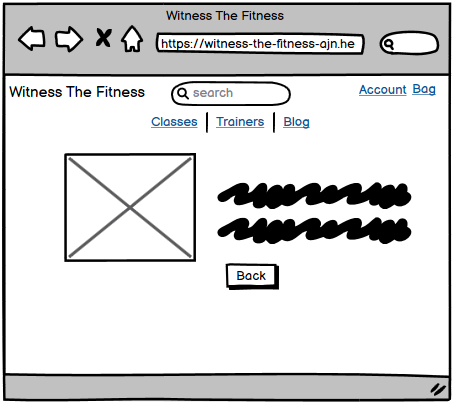
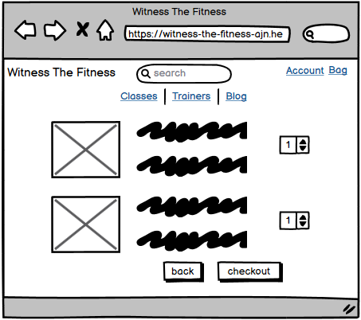
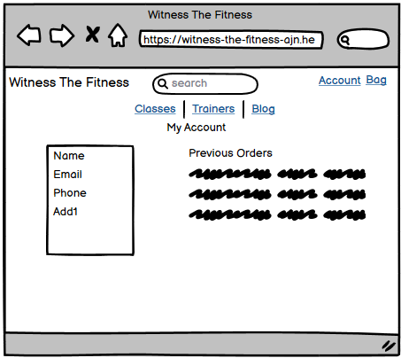

# Witness The Fitness

[Witness The Fitness](https://witness-the-fitness-ajn.herokuapp.com/) is currently a fictional fitness website. It for people intrested in fitness and wellbeing. The purpose of the website is to provide people with the chance to purchase different types of fitness experiences.

## Business Case

TBC

## Planning

### Wireframes

During the planning stage, I created several wireframe templates based on how I wanted the site to look. These are below.

#### **Home**

*Homepage*

#### **Blog**

*Blog*

*Blog Post Detail*

#### **Classes**

*Classes*

*Class Detail*

#### **Trainers**

*Trainers*

*Trainer Detail*

#### **Shopping Bag**

*Shopping Bag*

#### **Profile**

*Profile*

### User Stories

As part of the Agile process I created user stories to aid with planning for the project.

**User**

As a **User**

* I can view the different classes on offer.
* I can click on a class and view more detail.
* I can add choosen classes to a shopping bag.
* I can view and update my shopping bag.
* I can make purchases securely.
* I can register to the site.
* I can view and update my profile.
* I can view my order history.
* I can view blog posts.
* I can like/unlike blog posts.
* I can comment and delete my own comments on blog posts.
* I can view the trainers and their bio's.
* I can view sponsors.

**Admin**

As well as having the same abilities as users, admins also have the additional User Stories.

As an **Admin**

* I can create blog posts.
* I can update/delete blog posts.
* I can add new classes(products).
* I can update/delete existing classes(products).
* I can delete user blog comments if inappropriate.

## Database Models

There are several database Models created for the site and the different apps within it.

### Blog App

#### Post Model
    title = models.CharField(max_length=200, unique=True)
    slug = models.SlugField(max_length=200, unique=True)
    author = models.ForeignKey(User, on_delete=models.CASCADE, related_name="blog_posts")
    created_on = models.DateField(auto_now_add=True)
    featured_image = models.ImageField(null=True, blank=True)
    content = models.TextField()
    excerpt = models.TextField(blank=True)
    updated_on = models.DateTimeField(auto_now=True)
    status = models.IntegerField(choices=STATUS, default=0)
    likes = models.ManyToManyField(UserProfile, related_name="post_likes", blank=True)

#### Comment Model
    post = models.ForeignKey(Post, on_delete=models.CASCADE, related_name="comments")
    name = models.ForeignKey(User, on_delete=models.CASCADE, related_name="user_comments")
    body = models.TextField()
    created_on = models.DateTimeField(auto_now_add=True)

### Checkout App

#### Order Model
    order_number = models.CharField(max_length=32, null=False, editable=False)
    user_profile = models.ForeignKey(UserProfile, on_delete=models.SET_NULL, null=True, blank=True, related_name='orders')
    full_name = models.CharField(max_length=50, null=False, blank=False)
    email = models.EmailField(max_length=254, null=False, blank=False)
    phone_number = models.CharField(max_length=20, null=False, blank=False)
    country = CountryField(blank_label='Country *', null=False, blank=False)
    postcode = models.CharField(max_length=20, null=True, blank=True)
    town_or_city = models.CharField(max_length=40, null=False, blank=False)
    street_address1 = models.CharField(max_length=80, null=False, blank=False)
    street_address2 = models.CharField(max_length=80, null=True, blank=True)
    county = models.CharField(max_length=80, null=True, blank=True)
    date = models.DateTimeField(auto_now_add=True)
    order_total = models.DecimalField(max_digits=10, decimal_places=2, null=False, default=0)
    original_bag = models.TextField(null=False, blank=False, default='')
    stripe_pid = models.CharField(max_length=254, null=False, blank=False, default='')

#### OrderLineItem Model
    order = models.ForeignKey(Order, null=False, blank=False, on_delete=models.CASCADE, related_name='lineitems')
    sport = models.ForeignKey(Sports, null=False, blank=False, on_delete=models.CASCADE)
    quantity = models.IntegerField(null=False, blank=False, default=0)
    lineitem_total = models.DecimalField(max_digits=6, decimal_places=2, null=False, blank=False, editable=False)

### Profiles App

#### UserProfile
    user = models.OneToOneField(User, on_delete=models.CASCADE)
    default_phone_number = models.CharField(max_length=20, null=True, blank=True)
    default_street_address1 = models.CharField(max_length=80, null=True, blank=True)
    default_street_address2 = models.CharField(max_length=80, null=True, blank=True)
    default_town_or_city = models.CharField(max_length=40, null=True, blank=True)
    default_county = models.CharField(max_length=80, null=True, blank=True)
    default_postcode = models.CharField(max_length=20, null=True, blank=True)
    default_country = CountryField(blank_label='Country', null=True, blank=True)

### Sponsors App

#### Sponsors
    sponsor_name = models.CharField(max_length=100, null=False, blank=False)
    sponsor_bio = models.TextField(null=False)
    sponsor_image = models.ImageField(null=True, blank=True)
    sponsor_website = models.TextField(null=False)

### Sports App

#### Sports
    trainer_id = models.ForeignKey(Trainers, on_delete=models.CASCADE)
    sport_type = models.CharField(max_length=100, null=False, blank=False)
    sport_category = models.CharField(max_length=100, null=False, blank=False)
    sport_description = models.TextField(blank=True)
    sport_cost = models.DecimalField(max_digits=6, decimal_places=2, null=False, blank=False)
    sport_location = models.CharField(max_length=100, null=False, blank=False)
    sport_image = models.ImageField(null=True, blank=True)

### Trainers App

#### Trainers
    trainer_name = models.CharField(max_length=100, null=False, blank=False)
    slug = models.SlugField(max_length=200, unique=True, null=True)
    trainer_email = models.EmailField(max_length=254, null=False, blank=False)
    trainer_phone_number = models.CharField(max_length=20, null=False, blank=False)
    trainer_bio = models.TextField(null=False)
    trainer_image = models.ImageField(null=True, blank=True)
    trainer_category = models.CharField(max_length=20, blank=False, null=True)

## **Future Features**

There are some features I would like to add to the site in the future. I actually intend to try and develop this further into a fully functioning website although, when I do this, the inital focus will be just on personal training.
There are some features that I wanted to include when I first started the project but unfortunately I did not have the time to include these.
There are also other features that I would like to include as I develop the site further. These features are listed here.

* **Calendar Booking**
    * I wanted to include a way to book purchased lessons/classes when I initially planned the project but unfortunately did not have the time to research or include this. Users would be able to book, cancel and rebook lessons. Admins/Trainers would be able to cancel and rebook lessons when needed.

* **Social Login**
    * Users would be able to use their social accounts such as google or facebook to register to the site. This was also another feature that I unfortunately did not have time to achieve.

* **Fitness Tracking/Logging**
    * Users would be able to list their fitness journey and would be able to log things such as weight and also specifically for Personal Training, they would be able to track their workouts including weight, reps and distance of their exercises. Where possible, I'd like to include graphs so users can see their journey graphically.

* **Shop**
    * An online shop where users can buy Witness The Fitness branded clothes and accessories and also other brands. There would also be giftcards for sale.

* **Reviews/Ratings**
    * Users would be able to leave reviews for the trainers and classes.

## **Technologies Used**

**Programming Languages**

* [HTML](https://en.wikipedia.org/wiki/HTML)
* [Python](https://www.python.org/)
* [CSS](https://en.wikipedia.org/wiki/CSS)
* [Javascript](https://www.javascript.com/)

**Supporting Frameworks, Technologies and Credits**

* [Django](https://www.djangoproject.com/) - the base of the project, used for logins, views, forms amongst other things.
* [Bootstrap](https://getbootstrap.com/) - used for website design and responsiveness.
* [Heroku](https://heroku.com) - used for hosting the website.
* [Amazon AWS](https://aws.amazon.com/?nc2=h_lg) - for hosting static files and media.
* [ElephantSQL](https://www.elephantsql.com/) - used for the postgres database.
* [Mailchimp](https://mailchimp.com/) - for newsletter signup
* [Crispy Forms](https://django-crispy-forms.readthedocs.io/en/latest/) - used to format forms across the site.
* [Summernote](https://summernote.org/) - used for text input fields on the website to allow bullet points or numbered lists for fields like recipe instructions.
* [Pixabay](https://pixabay.com/) - images I've used on the site have come from Pixabay.
* [Google Fonts](https://fonts.google.com/) - used for font's on the site.
* [Font Awesome](https://fontawesome.com/) - used for icons across the site.
